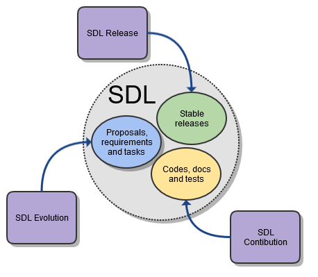
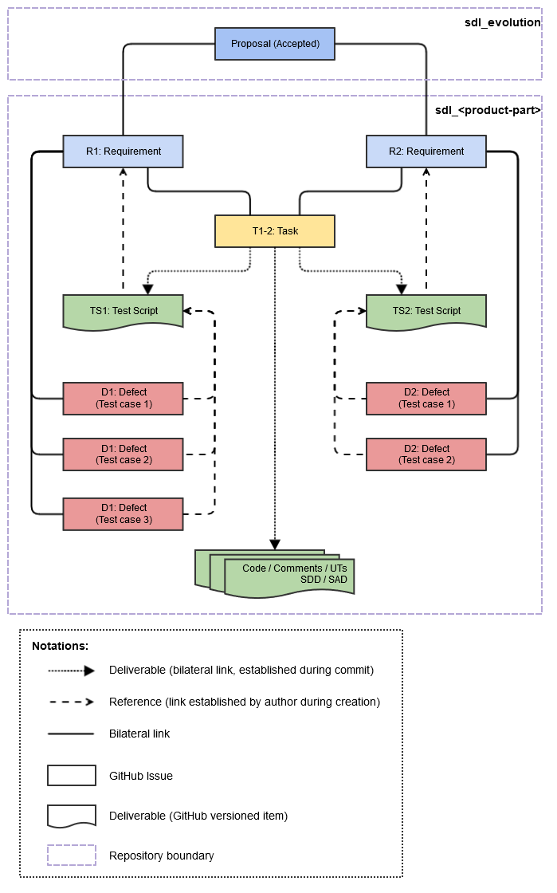

# **SDL Development Lifecycle**
You are welcome to participate in the evolution of SDL. Because of high quality expectation of SDL community, every contribution has to pass certain processing before it becomes an SDL evolutionary step. 
To make introduction of new ideas into SDL transparent and manageable, we outline in this document major stages of development lifecycle. 
We would like to emphasize that every contribution has to conform to agreed upon [definition of done (DoD)][DOD-LINK].

## **Scope**
SDL is a large product with multiple repositories. Some of them contains source codes for features and tests others mainly dedicated to documentation and some R&D experiments. The ones which do not strictly dedicated to documentation or R&D form set of product parts like SDL Core, ATF, ATF Scripts, HMI etc. Later in documentation those repositories are mentioned in generic manner: "product parts".

## **Lifecycle processes**
SDL lifecycle is based on three major processes:
- [SDL Evolution][SDL-EP-LINK]
- [SDL Contribution][SDL-CONT-LINK]
- [SDL Release][SDL-REL-LINK]

Next picture emphasize processes and their outcome in SDL. 
 

Each one of them might be executed in parallel or sequentially. However for each proposal there is a streamlined development process, outlined on following picture. 
 

## **Roles**
SDL lifecycle considers interactions of following groups:

- Stakeholders (primary responsible role SDL Project Manager)
- [Change Control Board (CCB)][CCB-LINK] (primary responsible role CCB Group Manager)
- Maintainers (primary responsible role is **Task Assignee**)
- Community (primary responsible role for propsal review is **Proposal Author**)

### Stakeholders
Primary owners of SDL.
Group responsbilities:
1. Assign responcible for proposal processing
2. Assign responsible for tasks realisation (*Maintainers*)
3. Approve potential contributors
4. Define priorities/business value of approved proposals
5. Delegate, by need, responcibility 1. and/or 2. to [CCB][CCB-LINK]

### Change Control Board
[CCB][CCB-LINK] is group of technical specialists gathered and approved by Stakeholders.
Their primary respocibility is to control state of the product.
Detailed description on group duties available in [here][CCB-LINK].

### Maintainers
Approved by Stakeholders potential contributors.
Their primary responsibility is providing delivery according SDL Contribution or SDL Release process.
For each task contributor must be assigned by Stakeholder or CCB.
Relations between Stakeholders and MAintainers are not part of this description.

### Community
Consumers of new SDL releases.
Generators of ideas and proposals for improvement in SDL project.
People which delivery most of the innovations in SDL through SDL Evolution process.

## **Processes**
This chapter alines important, for product quality, activities in a production chain.
All processes are built around GitHub and therefore presented as set of GitHub issues and wiki pages.

### [SDL Evolution][SDL-EP-LINK]
Change managemenet is important part of production chain. 
*Community* should propose improvements in the scope of [SDL Evolution][SDL-EP-LINK] process. 
Other groups which are involved in this process: *Stakeholders* and *[CCB][CCB-LINK]*. 
Usually Stakeholders define responcible for proposal processing, and [CCB][CCB-LINK] helps in clarifcation of specifications and impact. 
For proposals which recieved status **Accepted** after [review][SDL-EP-LINK] respective *proposal statement of work* will be deliniated. 
Statemenet of work for proposal includes set of GitHub issues created in repositories of affected *parts of product*. 

> **NOTE:** [SDL Evolution][SDL-EP-LINK] process stipulates possible communication channels,
> through which *Community* can delivery intial requests or answer questions.

**Outcome:** 
- Issue in [SDL Evolution repository][SDL-EP-LINK] for approved proposal (mandatory for accepted proposals only)
- Set of issues in respective repositories of product parts with requirements (mandatory for accepted proposals only)
- Set of issues in respective repositories of product parts with technical tasks (mandatory for accepted proposals only)
- Set of issues in respective repositories of product parts with defects (optional)

### [SDL Contribution][SDL-CONT-LINK]
Implementation of the proposal is the cornerstone of the SDL development.
To make the developement of SDL predictable and stable *Maintainers* should follow common rules in contribution.
SDL development is based on two principles:
- [A successful Git branching model][GitFlowModel]
- ["Fork & Pull" model][ForkAndPull]

> **Suggestion:** Use [GitFlow][GitFlowTools] for streamlined development.

**Outcome:**
- Stated in technical task deliverables in **develop** branches of affected *product parts*

### [SDL Release][SDL-REL-LINK]
Frequent releases are basis for stable software development.
In SDL releases are requested by Stakeholders through [CCB][CCB-LINK].

**Outcome:**
- Stable release for *Community*

## **Artifacts**
In the confines of OpenSDL lifecycle generic GitHub issues recieve following meanings: 
- Requirements
- Tasks
- Defects

Next picture shows relations between different arifacts in SDL. 
 
All of these artifacts have have specific namings and descrption template. 

**How to maintain artifacts** 
[GitHub][GitHub-LINK] services capabilities stipulate a lean approach to software development. 
Therefore each created artifact should not provide long descriptions and use as less as possible parameters. 
Crucial elements for model based on GitHub issues are **links**. 
Each and every change in existing model automatically triggers necessity to maintain links. 
Pay attention to the facts that all links between SDL artifacts are bilateral. 
This implies necessity to update also linked issues. 
To make this process easier, relation must be kept as simple as possible. 
Such as: *Proposal* (1 to 1) *Requirement* (1 to 1) *Technical task*. 
Maximum allowed complexity: *Proposal* (1 to 1) *Requirement and sub-requirements* (n to 1) *Technical task and sub-tasks*.

> **NOTE:** Always pay attention to provided in issue links and update them by need.

#### Requirements
These issues are high level description of expected outcome.
More or less they answer first basic question: **What has to be done?**
They form basis of acceptance criteria for future contribution.
Requirements issue can be created by *Stakeholders* or *[CCB][CCB-LINK]*.
Maximum two level of requirements are allowed.

**How to create requirement issue**
1. Select naming (title). 
Title tempalte: *R\<number\>:\<summary\>* 
Title must be sequentially numbered.
2. Writing of the description. 
Description template: 
> **Relations** 
> Proposal: *\<Link to proposal issue\>* 
> Parent: *\<Link to parent requirement issue or empty\>* 
> 
> **Priority** 
> Business value: *\<0..100\>*
> 
> **Description** 
> *\<Hihg level description of what is required to be done and acceptance criteria or link to the document in repository.\>*
> Expected delivery (in order of execution): 
>  [ ] Link to technical task 1
>  [ ] Link to technical task 2
>  [ ] Link to technical task 3
>  ... 

3. Establish links. 
Following links have to be established: 
- To related proposal issue (should be one)
- To parent requirement issue (only one, if applicable)

#### Technical tasks
These issues are high level description of technical task.
Basically they should answer second basic question: **How requirements have to be implemented?**
They form basis of acceptance criteria for future contribution.
Technical tasks issue can be created by *Stakeholders* or *[CCB][CCB-LINK]*.
Maximum two level of technical tasks are allowed.

**How to create technical issue**
1. Select naming (title). 
Title tempalte: *T\<number\>:\<summary\>* 
Title must be sequentially numbered.
2. Writing of the description. 
Description template: 
> **Relations** 
> Requirements: *\<Link to requirement issue\>*, *\<Link to requirement issue\>*... 
> Parent: *\<Link to parent technical tasks issue or empty\>* 
> 
> **Priority** 
> Severity: *\<High|Medium|Low\>* 
> 
> **Description** 
> *\<Hihg level description of how requirements have to be implemented.\>* 
> Expected delivery (read [DoD][DOD-LINK] for details): 
>  [ ] Source code updates 
>  [ ] Code comments 
>  [ ] UTs add/update 
>  [ ] Integration tests add/update 
>  [ ] SDD updates 
>  [ ] SAD updates 
>  [ ] Guidelines update 1 (*\<Link to repository with guidelines to be updated.\>*) 
>  [ ] Guidelines update 2 (*\<Link to repository with guidelines to be updated.\>*) 
>  ...

3. Establish following links. 
- To related requirement issues (one or many)
- To parent technical task issue (only one, if applicable)

#### Defects
Normally defects should be posted by [CCB][CCB-LINK] basing on the discussion initiated with *Comunity* in [SDL Evolution][SDL-EP-LINK] process. However memebers of the *Community* are also welcome to create defects in respective *product parts* repository. In both cases defects creation should follow same principles. 

Two main rules for defect creation:
1. Check if defect is already present.
2. One defect per (requirement / test case / environement).

**How to create defect**
1. Select naming (title). 
Title tempalte: *D\<number\>:\<summary\>* 
Title must be sequentially numbered.
2. Writing of the description. 
Description template: 
> **Relations** 
> Requirement: *\<Link to requirement which is failed\>* 
> Test script: *\<Link to test script with test case which fails or empty\>* 
> 
> **Priority** 
> Severity: *\<Hotfix|Blocker|Critical|Major|Normal|Minor|Trivial\>* 
> 
> **Description** 
> 
> Found in release: *\<High|Medium|Low\>* 
> *\<Detailed description, link to description or test case ID *(must be identifyable in test script)*.\>* 
> *\<Detailed description of expected result.\>* 
> 
> Test environment: 
> - HMI version:
> - ATF version:
> - OS:
> - Transport:
> - Mobile device:
> - Mobile OS:
> - Mobile App version:
> - Mobile App type (media/non-media/navi/any):
> - Virtual Machine using (yes/no):
> 
> Expected delivery (read [DoD][DOD-LINK] for details): 
>  [ ] Source code updates 
>  [ ] Code comments 
>  [ ] UTs add/update 
>  [ ] Integration tests add/update 
>  [ ] SDD updates 
>  [ ] SAD updates 
>  [ ] Guidelines update 1 (*\<Link to repository with guidelines to be updated.\>*) 
>  [ ] Guidelines update 2 (*\<Link to repository with guidelines to be updated.\>*) 
>  ...

3. Establish following links. 
- To related requirement issues (should be only one)
- To integration test script with test case (only one, if applicable)

## **Usefull links**
[SDL Evolution][SDL-EP-LINK] 
[Definition Of Done][DOD-LINK] 
[Change Control Board][CCB-LINK] 
[A successful Git branching model][GitFlowModel] 
[Fork & Pull model][ForkAndPull] 
[GitFlow][GitFlowTools] 
[GitFlow Cheatsheet][GFCheatsheet] 

[SDL-EP-LINK]: https://github.com/smartdevicelink/sdl_evolution/blob/master/process.md "SDL Evolution"
[DOD-LINK]: DefinitionOfDone.md "Definition Of Done"
[CCB-LINK]: ChangeControlBoard.md "Change Control Board"
[SDL-CONT-LINK]: SDLContribution.md "SDL Contribution"
[SDL-REL-LINK]: SDLRelease.md "SDL Release"
[GitFlowModel]: http://nvie.com/posts/a-successful-git-branching-model/ "A successful Git branching model"
[ForkAndPull]: https://help.github.com/articles/fork-a-repo/ "Fork & Pull model"
[GitFlowTools]: https://github.com/nvie/gitflow "GitFlow"
[GFCheatsheet]: http://danielkummer.github.io/git-flow-cheatsheet/ "GitFlow Cheatsheet"
[GitHub-LINK]: https://github.com/ "GitHub"
